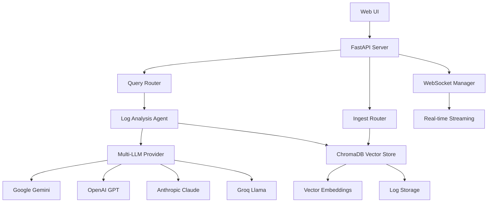

# ⚡ Flash.io
### Intelligent Real-Time Log Analysis with AI

<div align="center">
  
[](https://fastapi.tiangolo.com/)
[](https://python.org)
[](https://www.trychroma.com/)
[](https://openai.com)

*Transform your log chaos into actionable insights with the power of AI*

[🚀 Quick Start](#-quick-start) • [✨ Features](#-features) • [📖 Documentation](#-documentation) • [🎯 Use Cases](#-use-cases)

</div>

---

## 🌟 What is Flash.io?

**Flash.io** is a cutting-edge, AI-powered log analysis platform that revolutionizes how DevOps teams, system administrators, and developers monitor, analyze, and troubleshoot their applications and infrastructure. By combining advanced vector embeddings, multiple Large Language Models (LLMs), and real-time streaming capabilities, Flash.io transforms raw log data into intelligent, actionable insights.

### 🎯 The Problem We Solve

- **Log Overload**: Modern systems generate millions of log entries daily
- **Manual Analysis**: Traditional log analysis is time-consuming and error-prone
- **Pattern Recognition**: Identifying critical issues buried in noise
- **Real-time Monitoring**: Need for instant alerts and insights
- **Context Loss**: Difficulty correlating events across different services

### 💡 Our Solution

Flash.io leverages state-of-the-art AI to provide:
- **Natural Language Queries**: Ask questions in plain English
- **Intelligent Pattern Detection**: AI identifies anomalies and correlations
- **Real-time Analysis**: Live log streaming with instant insights
- **Multi-Provider LLM Support**: Choose from Google Gemini, OpenAI GPT, Anthropic Claude, or Groq
- **Vector-Based Search**: Semantic understanding of log content
- **Historical Context**: Maintains conversation history and analysis state

---

## ✨ Features

### 🤖 **AI-Powered Analysis**
- **Multi-LLM Support**: Google Gemini, OpenAI GPT-4, Anthropic Claude, Groq Llama
- **Natural Language Queries**: "Show me database errors from the last hour"
- **Intelligent Summarization**: AI-generated insights and recommendations
- **Context-Aware Analysis**: Maintains conversation history and system state

### 🔍 **Advanced Search & Discovery**
- **Vector Embeddings**: Semantic search using Google's embedding models
- **Smart Filtering**: Time-based, service-based, and severity-based filters
- **Pattern Recognition**: Automatically detect recurring issues and anomalies
- **Correlation Analysis**: Link related events across different services

### 📊 **Real-Time Monitoring**
- **Live Log Streaming**: WebSocket-based real-time log ingestion
- **Instant Alerts**: Immediate notification of critical issues
- **Agent State Management**: Persistent analysis state across sessions
- **Automated Cleanup**: Configurable log retention policies

### 🏗️ **Flexible Architecture**
- **Multiple Data Sources**: Support for various log formats and sources
- **RESTful API**: Complete programmatic access to all features
- **Extensible Design**: Plugin architecture for custom log sources
- **Scalable Storage**: ChromaDB vector database for efficient storage

### 🎨 **Modern User Interface**
- **Responsive Design**: Beautiful, mobile-first web interface
- **Real-Time Updates**: Live data streaming with WebSocket connections
- **Interactive Dashboards**: Intuitive navigation and data visualization
- **Progressive Enhancement**: Works across all modern browsers

---

## 🚀 Quick Start

### Prerequisites

- **Python 3.13+**
- **API Keys** for at least one LLM provider:
  - Google AI (Gemini) - Recommended
  - OpenAI (GPT-4)
  - Anthropic (Claude)
  - Groq (Llama)

### 🛠️ Installation

1. **Clone the Repository**
   ```bash
   git clone https://github.com/yourusername/flashio.git
   cd flashio
   ```

2. **Install Dependencies**
   ```bash
   pip install -r requirements.txt
   ```

3. **Generate Security Keys**
   ```bash
   python generate_keys.py
   ```

4. **Configure Environment**
   ```bash
   cp .env_sample .env
   # Edit .env with your API keys and configuration
   ```

5. **Set Up Database** (Optional)
   ```bash
   python setup_database.py
   ```

6. **Start the Application**
   ```bash
   python main.py
   ```

7. **Access Flash.io**
   ```
   🌐 Web Interface: http://localhost:8000
   📚 API Documentation: http://localhost:8000/docs
   ```

---

## ⚙️ Configuration

### Environment Variables

Create a `.env` file in the root directory:

```env
# Database Configuration
CHROMA_DB_PATH=./chroma_db
LOG_RETENTION_DAYS=30
MAX_BATCH_SIZE=100
PROCESSING_INTERVAL=5

# AI Provider Configuration
DEFAULT_PROVIDER=google
DEFAULT_MODEL=gemini-1.5-pro

# API Keys (at least one required)
GOOGLE_API_KEY=your_google_api_key_here
OPENAI_API_KEY=your_openai_api_key_here
GROQ_API_KEY=your_groq_api_key_here
ANTHROPIC_API_KEY=your_anthropic_api_key_here

# Security Configuration
ENCRYPTION_KEY=your_generated_encryption_key
API_KEY_HASH=your_generated_api_key_hash
```

### Supported LLM Providers

| Provider | Models | Use Case |
|----------|--------|----------|
| **Google** | `gemini-1.5-pro`, `gemini-1.5-flash` | Recommended for general use |
| **OpenAI** | `gpt-4`, `gpt-3.5-turbo` | Excellent reasoning capabilities |
| **Anthropic** | `claude-3-opus`, `claude-3-sonnet` | Superior safety and analysis |
| **Groq** | `llama3-70b-instruct`, `llama3-8b-8192` | High-speed inference |

---

## 🎯 Use Cases

### 🔧 **DevOps & SRE**
- **Incident Response**: Quickly identify root causes during outages
- **Performance Monitoring**: Detect degradation patterns before they impact users
- **Capacity Planning**: Analyze usage trends and resource consumption
- **Automated Reporting**: Generate intelligent summaries for stakeholders

### 🏢 **Enterprise Operations**
- **Compliance Monitoring**: Track security events and access patterns
- **Business Intelligence**: Extract insights from application logs
- **Cost Optimization**: Identify resource waste and optimization opportunities
- **Predictive Maintenance**: Anticipate failures before they occur

### 👨‍💻 **Development Teams**
- **Bug Investigation**: Trace issues across microservices
- **Performance Optimization**: Identify bottlenecks and slow queries
- **Feature Monitoring**: Track new feature adoption and issues
- **Code Quality**: Monitor error rates and exception patterns

---

## 📖 Documentation

### 🌐 **Web Interface Guide**

#### Navigation Tabs

- **📥 Ingest**: Upload and import log files
- **🔍 Query**: Natural language log analysis
- **🤖 Agent**: AI agent state and conversation history
- **🗃️ Database**: Log storage management and statistics
- **📡 Live**: Real-time log streaming and monitoring

#### Using Natural Language Queries

```
Examples:
• "Show me all database errors from the last 2 hours"
• "Find memory usage spikes in the payment service"
• "What caused the 500 errors this morning?"
• "Compare performance between today and yesterday"
• "Show me unusual patterns in the authentication logs"
```

### 🔌 **API Reference**

#### Core Endpoints

- **`POST /queries/natural`** - Submit natural language queries
- **`GET /queries/insights`** - Retrieve system insights and agent state
- **`POST /queries/configure-model`** - Switch between LLM providers
- **`POST /ingest/logs`** - Ingest log data
- **`GET /logs/search`** - Search logs with filters
- **`WebSocket /ws`** - Real-time log streaming

#### Example API Usage

```python
import requests

# Natural language query
response = requests.post("http://localhost:8000/queries/natural", json={
    "query": "Show me database connection errors from the last hour",
    "max_logs": 50,
    "include_context": True
})

# Process results
analysis = response.json()
print(f"Analysis: {analysis['analysis']}")
for log in analysis['logs']:
    print(f"[{log['timestamp']}] {log['message']}")
```

---

## 🏗️ Architecture

### System Components



### Data Flow

1. **Log Ingestion**: Logs enter through API endpoints or real-time streams
2. **Vector Embedding**: Content is processed using Google's embedding models
3. **Storage**: Logs are stored in ChromaDB with vector representations
4. **Query Processing**: Natural language queries are translated to search parameters
5. **AI Analysis**: Selected LLM analyzes logs and generates insights
6. **Response**: Results are returned with analysis and recommendations

---

## 🔧 Advanced Usage

### Custom Log Sources

Extend Flash.io by implementing custom log sources:

```python
from log_sources import LogSource

class CustomLogSource(LogSource):
    async def stream_logs(self):
        # Implement your custom log streaming logic
        pass
    
    async def get_logs(self, start_time, end_time, filters):
        # Implement log retrieval logic
        pass
```

### Database Integration

Flash.io supports multiple database backends for log storage:

- **PostgreSQL**: Enterprise-grade relational storage
- **MySQL**: Popular open-source database
- **SQLite**: Lightweight local storage

### Cloud Deployments

Deploy Flash.io to your preferred cloud platform:

- **AWS**: Use CloudWatch integration for log ingestion
- **Google Cloud**: Leverage Stackdriver logs
- **Azure**: Connect to Azure Monitor logs
- **Docker**: Container-ready deployment

---

## 🛡️ Security

### Data Protection
- **Encryption at Rest**: All sensitive data is encrypted using AES-256
- **API Key Management**: Secure credential storage and rotation
- **Access Control**: Token-based authentication for API access
- **Data Retention**: Configurable automatic cleanup policies

### Privacy
- **Local Processing**: Logs can be processed entirely on-premises
- **No Data Transmission**: Optional cloud-free operation
- **Audit Trails**: Complete logging of all analysis activities

---

## 🤝 Contributing

We welcome contributions! Here's how to get started:

1. **Fork the Repository**
2. **Create a Feature Branch**: `git checkout -b feature/amazing-feature`
3. **Commit Your Changes**: `git commit -m 'Add amazing feature'`
4. **Push to Branch**: `git push origin feature/amazing-feature`
5. **Open a Pull Request**

### Development Setup

```bash
# Install development dependencies
pip install -r requirements.txt

# Run tests
python -m pytest

# Start development server
python main.py
```

---

## 📋 Requirements

### Core Dependencies
- **FastAPI 0.115.9**: Modern, fast web framework
- **ChromaDB 1.0.5**: Vector database for embeddings
- **LangChain**: LLM integration framework
- **Google AI**: Generative AI and embeddings
- **Uvicorn**: ASGI server for deployment

### AI Provider SDKs
- **google-generativeai**: Google Gemini integration
- **openai**: OpenAI GPT models
- **anthropic**: Anthropic Claude models
- **groq**: Groq inference platform

---

## 🔍 Troubleshooting

### Common Issues

**API Key Errors**
```bash
# Verify your API keys are correctly set
python -c "from config import GOOGLE_API_KEY; print('✓ API key configured' if GOOGLE_API_KEY else '✗ API key missing')"
```

**Database Connection Issues**
```bash
# Check ChromaDB path and permissions
ls -la ./chroma_db/
```

**Memory Issues**
```bash
# Reduce batch size in configuration
export MAX_BATCH_SIZE=50
```

### Getting Help

- **Documentation**: Check our comprehensive guides
- **Issues**: Report bugs on GitHub Issues
- **Discussions**: Join our community discussions
- **Support**: Contact our support team

---

## 🚀 Roadmap

### Upcoming Features

- **🎨 Enhanced Visualizations**: Interactive charts and graphs
- **📱 Mobile App**: Native iOS and Android applications
- **🔌 More Integrations**: Slack, Teams, PagerDuty notifications
- **🤖 Advanced AI**: Custom model fine-tuning capabilities
- **☁️ Cloud Services**: Managed Flash.io cloud offering

### Version History

- **v0.1.0**: Initial release with core features
- **v0.2.0**: Multi-LLM support and enhanced UI
- **v0.3.0**: Real-time streaming and WebSocket integration

---

<div align="center">

### 🌟 Star us on GitHub if Flash.io helps your team!


*Transform your logs into insights with the power of AI*

</div>
